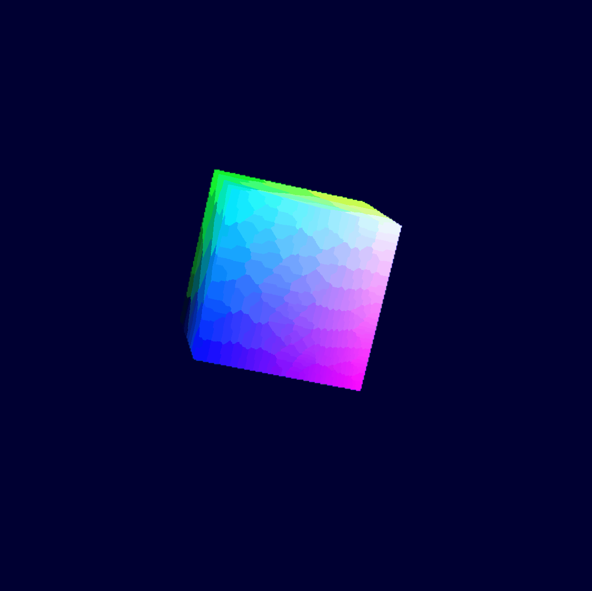

# cozyhome-webgpu-cozylib
This project seems to be growing much larger than I anticipated, as I partly switch the focus into a more general 3D engine.
I think its best that this project be interpreted as a standard scene viewer/editor for editing geometry. This editor will exist
to interpret and visualize an 'arbitrary' collection of geometric primitives, models, etc. It IS NOT intended to be used as an
engine AS IS. 

  

